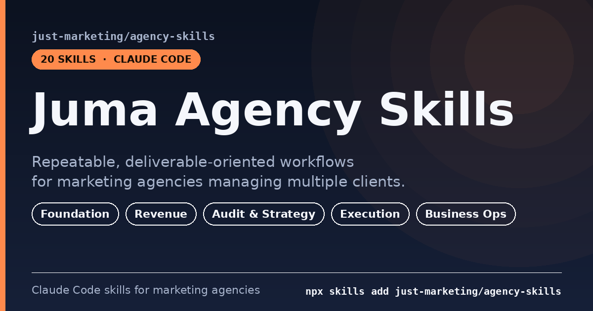

# Juma Agency Skills



Claude Code skills built by [Juma.ai](https://juma.ai) for marketing agencies managing multiple clients. These skills complement Juma's collaborative AI workspace by providing repeatable, deliverable-oriented workflows that agencies can run across all their clients.

[](https://skills.sh/just-marketing/agency-skills)
[](./LICENSE)

## Installation

### Via the Skills CLI (recommended)

Install the whole pack:

```bash
npx skills add just-marketing/agency-skills
```

Install a single skill:

```bash
npx skills add just-marketing/agency-skills -s juma-seo-audit
```

### Via the Claude Code marketplace

```bash
/plugin marketplace add just-marketing/agency-skills
/plugin install juma-agency-skills
```

### Manual

```bash
git clone https://github.com/just-marketing/agency-skills.git
cp -r agency-skills/skills/juma-seo-audit .claude/skills/
```

## Skills Catalog

### Foundation
| Skill | Description |
|-------|-------------|
| `juma‑client‑context` | Structured client profile: brand, audiences, competitors, goals, voice, budget. Referenced by all other skills. |
| `juma‑client‑brief` | Translates vague client requests into structured briefs with objectives, metrics, and constraints. |

### Revenue-Generating Deliverables
| Skill | Description |
|-------|-------------|
| `juma‑proposal` | Agency proposal with situation analysis, strategy, tiered pricing, and case study references. |
| `juma‑sow` | Statement of work with deliverable breakdown, acceptance criteria, and change order process. |
| `juma‑reporting` | Monthly/weekly performance reports with "so what?" storytelling and recommendations. |
| `juma‑client‑qbr` | Quarterly business review: performance vs goals, strategic recs, renewal framing. |

### Audit & Strategy
| Skill | Description |
|-------|-------------|
| `juma‑channel‑audit` | Channel-by-channel assessment with opportunity scoring and effort/impact matrix. |
| `juma‑competitor‑intel` | 3-5 competitor analysis across messaging, channels, content, SEO, ads, and social. |
| `juma‑seo‑audit` | Technical + strategic SEO audit with weighted scoring in client-deliverable format. |
| `juma‑geo‑audit` | AI search visibility assessment: brand mentions in LLMs, citability scoring, GEO comparison. |
| `juma‑cro‑audit` | Conversion audit: friction points, trust signals, CTA effectiveness, prioritized test roadmap. |
| `juma‑campaign‑plan` | Multi-channel campaign plan with creative briefs, budget allocation, and measurement plan. |

### Execution
| Skill | Description |
|-------|-------------|
| `juma‑content‑calendar` | Monthly/quarterly editorial plan with pillar topics and repurposing workflows. |
| `juma‑paid‑media‑plan` | Platform selection, audience targeting, budget allocation, and bidding strategy. |
| `juma‑ab‑test‑plan` | Hypothesis formulation, sample size calculations, test design, and results template. |
| `juma‑analytics‑setup` | GA4 setup, conversion events, UTM standards, attribution, and dashboard configuration. |

### Business Operations
| Skill | Description |
|-------|-------------|
| `juma‑case‑study` | Challenge/strategy/results framework in multiple formats (long-form, one-pager, social). |
| `juma‑upsell‑finder` | Identifies expansion opportunities from performance data and service gaps. |
| `juma‑retainer‑review` | Internal profitability analysis: hours vs contracted, scope creep, renewal recs. |
| `juma‑onboarding‑checklist` | Access provisioning, kickoff agenda, audit schedule, first-30-days milestones. |

## Workflow Examples

### New Client Onboarding
1. `juma-onboarding-checklist` - Set up access and kickoff
2. `juma-client-context` - Build the client profile
3. `juma-channel-audit` - Assess current state
4. `juma-competitor-intel` - Map the competitive landscape
5. `juma-proposal` / `juma-sow` - Scope the engagement

### Quarterly Review Cycle
1. `juma-reporting` - Compile monthly reports
2. `juma-client-qbr` - Build the quarterly review
3. `juma-upsell-finder` - Identify expansion opportunities
4. `juma-retainer-review` - Assess internal profitability

### Campaign Launch
1. `juma-client-brief` - Structure the campaign request
2. `juma-campaign-plan` - Plan channels and creative
3. `juma-content-calendar` - Schedule content
4. `juma-paid-media-plan` - Plan paid channels
5. `juma-analytics-setup` - Configure tracking

## Cross-Reference Map

```
juma-client-context  <-- referenced by ALL skills
  |
  +-- juma-client-brief --> juma-campaign-plan --> juma-content-calendar
  |                     --> juma-proposal --> juma-sow --> juma-retainer-review
  |                                                   --> juma-onboarding-checklist
  +-- juma-competitor-intel --> juma-channel-audit --> juma-upsell-finder
  |                                               --> juma-campaign-plan
  +-- juma-seo-audit --> juma-geo-audit
  +-- juma-cro-audit --> juma-ab-test-plan
  +-- juma-analytics-setup
  +-- juma-paid-media-plan
  +-- juma-reporting --> juma-client-qbr --> juma-upsell-finder
  |                  --> juma-case-study
  +-- juma-retainer-review
```

## About Juma.ai

Juma is a collaborative AI workspace built for marketing teams and agencies. With Flows, Projects, and purpose-built AI agents, Juma helps agencies scale content production, manage multiple clients, and maintain brand consistency across all deliverables.

Learn more at [juma.ai](https://juma.ai).
